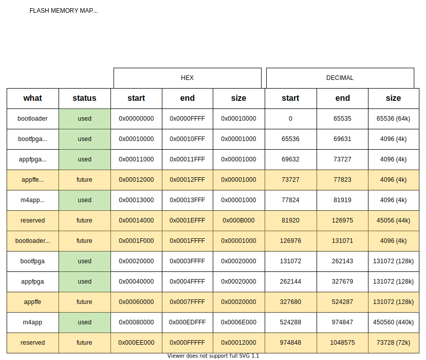

QORC Bootloader CLI Application
===============================

Intro
-----
Experimental BL with CLI.

Build
-----
from the [project root] execute:

::

  make -C GCC_Project

Debug
-----

JLink
~~~~~

- connect to the Cortex-M4 as usual
- load the binary and run with the following sequence

  ::
    
    rsettype 3
    r
    loadbin PATH/TO/PROJECT/GCC_Project/output/bin/qorc_bootloader_cli.bin 0x0
    r
    g

OpenOCD
~~~~~~~

- run openocd with interface cfg (jlink.cfg or stlink.cfg or other depending on the probe) and 
  eos_s3.cfg 

- start gdb client using the arm toolchain's :code:`arm-none-eabi-gdb`

- In the (gdb) connect to the remote :code:`target extended-remote localhost:3333`

- load the binary adn run with the following sequence

  ::

    mon reset init
    restore PATH/TO/PROJECT/GCC_Project/output/bin/qorc_bootloader_cli.bin binary 0x0
    mon reset halt
    mon reset run

Flash
-----

If you want to flash the experimental bootloader, replacing the bootloader on the flash, it would 
be the same as updating the bootloader:

::

  qfprog --port /dev/ttyACM0 --bootloader GCC_Project/output/bin/qorc_bootloader_cli.bin

Running Behavior
----------------

Once the binary is loaded and running (from Debug or after Flashing), you should see the following behavior:

- RGB LED flashes in yellow-cyan toggle every 1 second

- Attach a serial terminal application (GTKTerm/PuTTY etc.) to both USBSERIAL and the EOSS3 UART:

  ::

    USBSERIAL  : /dev/ttyACM0
    EOSS3 UART : /dev/ttyUSB0

- Debug prints come over the EOSS3 UART, and the CLI Menu will appear on the USBSERIAL

- You might miss the initial prints of the CLI, just press :code:`ENTER` a few times, and you should see 
  the prompt:

  ::

    [0] > 

- type :code:`bl` to enter the bootloader menu, followed by :code:`help` to see the options, and you should 
  see:

  ::

    [0] > 
    [0] > 
    [0] > bl
    [1] bl > help
    help-path: bl
    flash          - goto flash mode
    runm4          - run m4 only code
    runfpga        - run fpga only code
    runfpgam4      - run fpga+m4 code
    exit           - exit/leave menu
    help           - show help
    ?              - show help
    help-end:
    [1] bl >

- type :code:`flash` to enter flash mode.

  you should see the yellow-cyan LED flash stop

- disconnect the serial terminal application from :code:`/dev/ttyACM0`

- invoke the programmer to test the communication, for example:

  ::

    $ qfprog --crc --mode
    CLI mode
    ports =  ['/dev/ttyACM0 (QuickFeather)'] 1
    Using port  /dev/ttyACM0 (QuickFeather)
    bootloader: b'6a068e02a0a80000'
    boot fpga : b'8319fc82b8280100'
    M4 app    : b'3f117a6bb08b0000'
    app fpga  : b'1c438d0800290100'
    mode: [fpga-m4]

- invoke the programmer to flash the m4app and appfpga

  we would prefer to use:
  
  ::
    
    m4app   : test_bins/qf_helloworldm4/qf_helloworldm4.bin
    appfpga : test_bins/qf_helloworldfpga/helloworldfpga.bin

  These come from:

  ::

    qorc-testapps/qf_helloworldm4/GCC_Project/output/bin/qf_helloworldm4.bin
    qorc-testapps/qf_helloworldfpga/fpga/rtl/helloworldfpga.bin

  The m4app used above does not use/load any fpga image, and only prints out stuff on EOSS3 UART.

  The appfpga used above does not depend on m4, and only does a LED Blink.
  
  Alternatively, you can use :code:`test_bins/qorc_fpga_pwm/AL4S3B_FPGA_Top.bin` as well.

  Flash using:

  ::

    qfprog --m4app test_bins/qf_helloworldm4/qf_helloworldm4.bin --appfpga test_bins/qf_helloworldfpga/helloworldfpga.bin --mode fpga-m4

- Now we can test running the flashed stuff.

  In case you are running the bootloader from flash, reset the board.

  In case you are running from debugger, reload the bootloader and run it as before.

  Connect serial terminal to both USBSERIAL and EOSS3 UART.

  You should see the CLI prompt on USBSERIAL (if not, press ENTER a few times)

- Enter the bootloader menu using :code:`bl` and type :code:`help` for list of commands.

- To run the M4 only use :code:`runm4` command - look at the EOSS3 UART output to see M4 code running

- To run the fpga only use :code:`runfpga` command - look at the LED to check FPGA code running

- To run both use :code:`runfpgam4` command, the fpga code is loaded, followed by the m4 code.

Memory Map
----------

The flash memory map defined for q-series devices is as below:

Communication Interface
-----------------------

This bootloader project uses USB-Serial interface available on the
Quickfeather board to receive and transmit commands from TinyFPGA
Programmer.
